class: animate__animated, animate__fadeIn, has-logo

# Outline

1. Phenomics and Genetic Gain  
2. Case Studies  
3. Phenomics vs. Genomics  
4. Applications, Limitations, and Challenges
5. Phenomics Data Flow

---
class: animate__animated, animate__fadeIn
# Phenomics and Genetic Gain

$$
\Delta G = \frac{\color{red}{i} \cdot \color{red}{r_a} \cdot \color{red}{\sigma_a}}{\color{red}{L}}
$$

\begin{aligned}
\Delta G & : \text{genetic gain per selection cycle} \\
\color{red}{i} & : \text{selection intensity} \\
\color{red}{r_a} & : \text{selection accuracy (improved with high-throughput phenotyping)} \\
\color{red}{\sigma_a} & : \text{additive genetic standard deviation} \\
\color{red}{L} & : \text{length of the selection cycle (years)}
\end{aligned}

--


```{r, echo=FALSE, out.width="110%",fig.cap="", fig.align="center",warning = FALSE, message = FALSE}

library(tibble)
library(dplyr)
library(kableExtra)
tbl <- tribble(
  ~Component, ~`How Phenomics Increases Genetic Gain`, ~`Effect on Genetic Gain`,
  "$i, r_{a}$",  "Reduces experimental error", "↑ Heritability → ↑ Accuracy",
  "$i, r_{a}$",  "Enables repeated temporal measurements", "↑ Precision of estimates",
  "$\\sigma_{a}$", "Increases the number of plants measured", "↑ Statistical robustness and ↑ genetic variance",
  "$L$", "Early selection", "Genetic correlation between traits (e.g., root angle ↔ resilience) or early evaluation (e.g., disease resistance)"
)

# Renderizar com estilo
tbl %>%
  kable("html", escape = FALSE, align = "c") %>%
  kable_styling(
    bootstrap_options = c("striped", "hover", "condensed"),
    full_width = FALSE, 
    position = "center", 
    font_size = 14
  ) %>%
  column_spec(1, bold = TRUE, width = "5em") %>%
  column_spec(2, width = "20em") %>%
  column_spec(3, width = "20em")

```


---
class: animate__animated, animate__fadeIn
name: phenomics-combined

# Phenomics: More Genetic Gain, Lower Cost

- **Use of secondary traits** correlated with the main trait
- **High initial investment** in sensors & infrastructure
- **Low-cost platforms** enable large-scale data capture
- **<span style="color:red; font-weight:bold;">Cost per data point drops drastically as scale increases!</span>**
- **Automation** reduces labor costs
- **No reagent costs**

---
class: animate__animated, animate__fadeIn, inverse, center, middle

# Case Study: Integrating Genomics and High-Throughput Phenomics in the Genotype × Plant Growth-Promoting Bacteria Interaction

---
class: animate__animated, animate__fadeIn

# Materials and Methods

+ Greenhouse conditions  
+ Early maize development stage (six fully expanded leaves)  
+ 360 inbred lines  
+ 13,826 SNPs  
+ Two managements, both under nitrogen limitation:  
  - **B+** Synthetic population of 4 PGPR (Plant Growth-Promoting Rhizobacteria):  
      * *Bacillus thuringiensis* RZ2MS9  
      * *Delftia* sp. RZ4MS18  
      * *Pantoea agglomerans* 33.1  
      * *Azospirillum brasilense* Ab-v5  
  - **B-** Without PGPR  
+ 2 replicates  
+ Total of 1,512 plots

---
class: animate__animated, animate__fadeIn

# Why Use High-Throughput Phenotyping?
```{r, echo=FALSE, out.width="85%",fig.cap="", fig.align="center"}
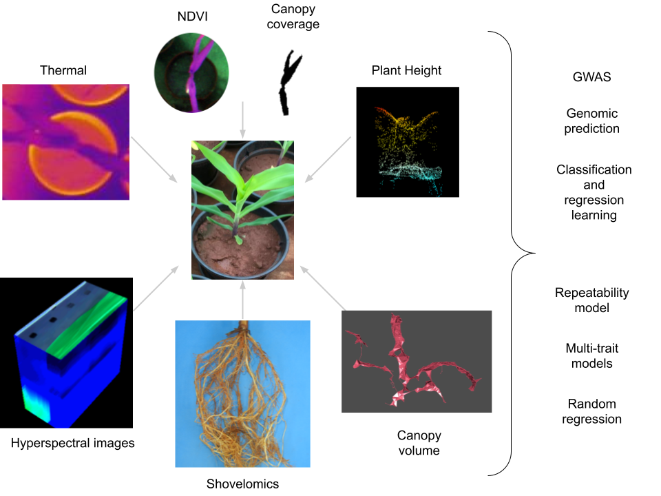
```
  
---

class: animate__animated, animate__fadeIn

# A Low-Cost Greenhouse High-Throughput Phenotyping Platform

```{r, echo=FALSE, out.width="75%",fig.cap="", fig.align="center"}
knitr::include_graphics("figs/Screen Shot 2022-01-05 at 7.54.52 PM.png")
```
<p style="font-family: times, serif; font-size:11pt; font-style:italic">
Figure. Representation of the low-cost High-Throughput Phenotyping platform.
</p>


---
class: animate__animated, animate__fadeIn

# Thermal and Multispectral Image Collection

```{r  , echo=FALSE, fig.show = "hold", out.width = "50%", fig.align = "default"}
knitr::include_graphics("figs/RGB_colection.gif")
knitr::include_graphics("figs/thermal_coletion.gif")
```
<p style="font-family: times, serif; font-size:11pt; font-style:italic">
Figure. Representation of RGB (left) and thermal (right) image acquisition using the low-cost High-Throughput Phenotyping (HTP) platform.
</p>

---
class: animate__animated, animate__fadeIn

# Data Acquisition

```{r, echo=FALSE, out.width="90%",fig.cap="", fig.align="center"}
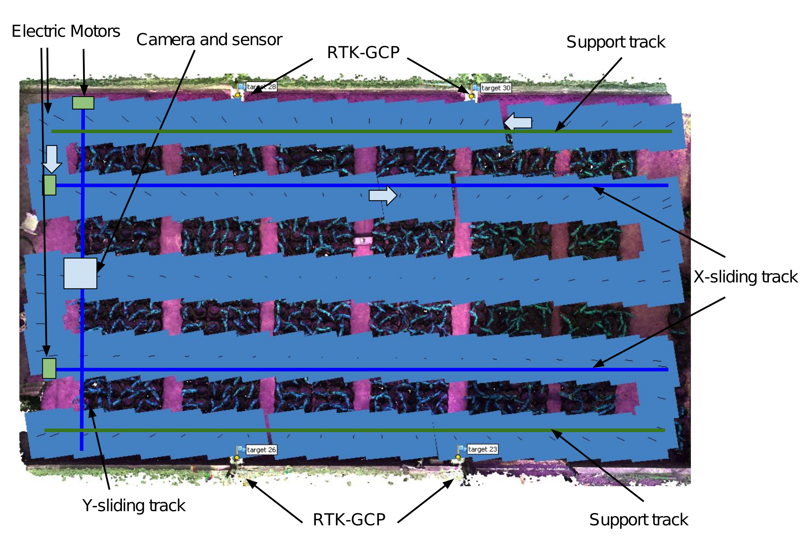
```
<p style="font-family: times, serif; font-size:11pt; font-style:italic">
Figure. Design of the greenhouse-based high-throughput phenotyping platform.
</p>

---
class: animate__animated, animate__fadeIn
# Hyperspectral Image Acquisition

```{r, echo=FALSE, out.width="90%",fig.cap="", fig.align="center"}
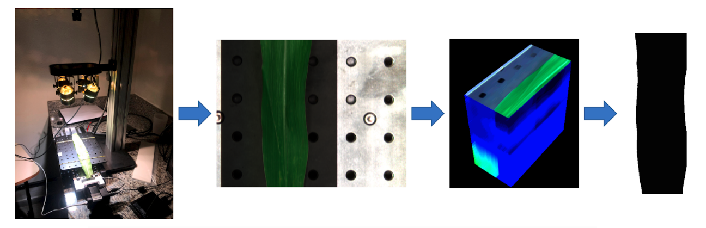
```
<p style="font-family: times, serif; font-size:11pt; font-style:italic">
Figure. Summary of data acquisition and processing. A) benchtop hyperspectral camera used for data collection; B) region of interest of the last fully expanded leaf; C) image cube; and D) image mask.
</p>

---
class: animate__animated, animate__fadeIn

# Data processing 
```{r, echo=FALSE, out.width="75%", fig.align="center"}
knitr::include_graphics("figs/fig02.png")
```
<p style="font-family: times, serif; font-size:10pt; font-style:italic">
Figure. Summary of multispectral image processing. (A) image acquisition; (B) orthomosaic assembly; (C) plot clipping; (D) canopy cover (CC); (E) dense point cloud; (F) plant height (PH) calculated from differences between the dense point cloud with plants and the dense point cloud with only the pot; (G) dense point cloud after applying a filter to remove the background; (H) dense point cloud for each plot; (I) 3D reconstruction of the dense point cloud to obtain canopy volume; and (J) f(biomass) obtained from the product of plant height (PH) and CC.
</p>

---
class: animate__animated, animate__fadeIn

# Shovelomics 

```{r, echo=FALSE, out.width="100%",fig.cap="", fig.align="center"}
knitr::include_graphics("figs/molbreed.png")
```
---
class: animate__animated, animate__fadeIn
# Multi-phenotype Genomic prediction
```{r, echo=FALSE, out.width="70%",fig.cap="", fig.align="center"}
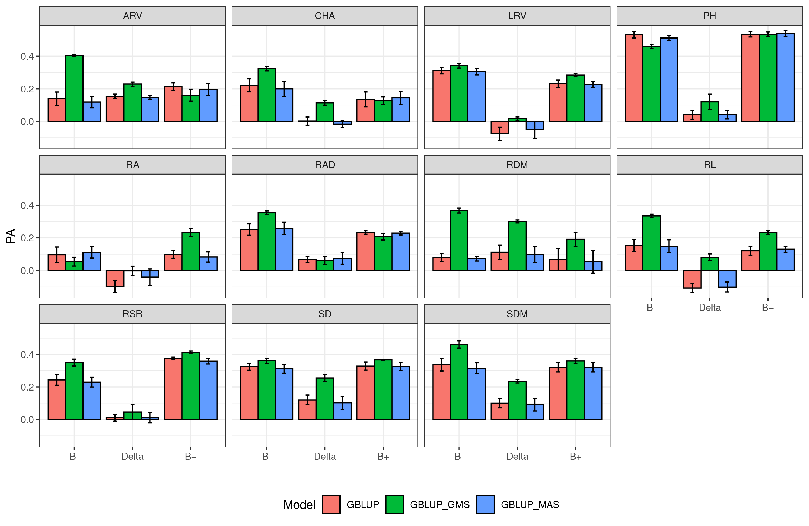
```
<p style="font-family: times, serif; font-size:11pt; font-style:italic">
Figure. Genomic prediction using GBLUP, GBLUP_GMS (GBLUP based on marker selection via GWAS), and GBLUP_MAS (GBLUP + marker-assisted selection) for various traits and managements.
</p>

---
class: animate__animated, animate__fadeIn
```{r, echo=FALSE, out.width="120%",fig.cap="", fig.align="center"}
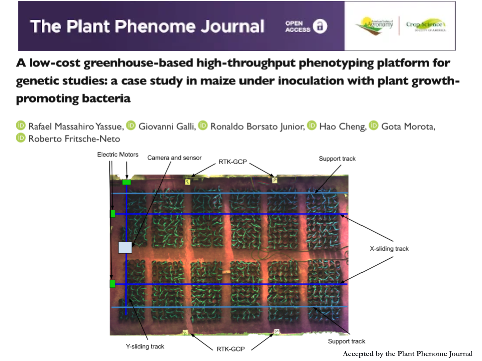
```

---
# Plant Growth
```{r, echo=FALSE, out.width="65%", fig.align="center"}
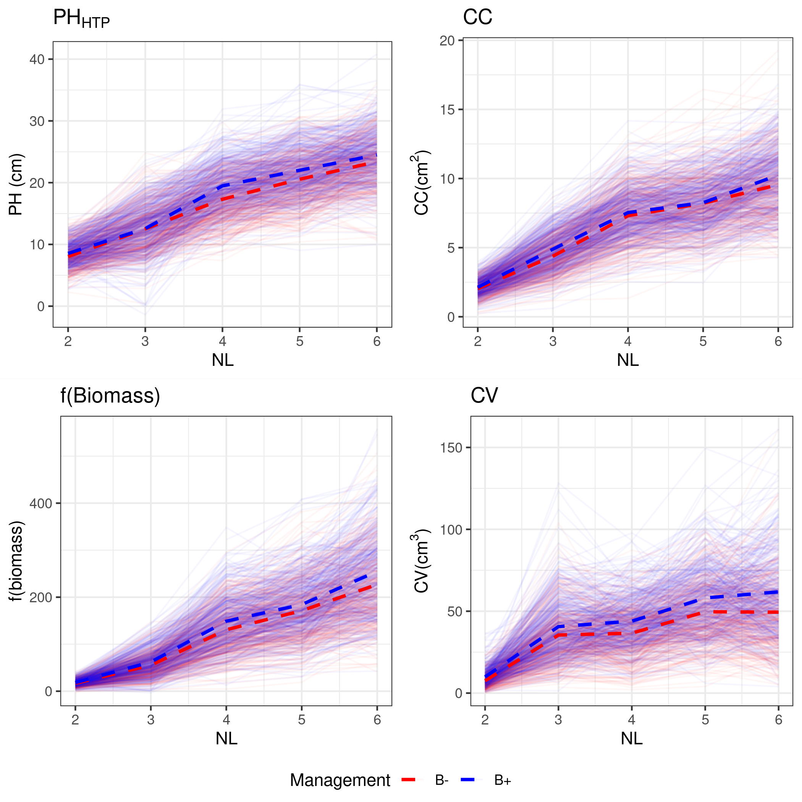
```
---
class: animate__animated, animate__fadeIn

# Phenotypic and Genomic Correlations
```{r, echo=FALSE, out.width="100%",fig.cap="", fig.align="center"}
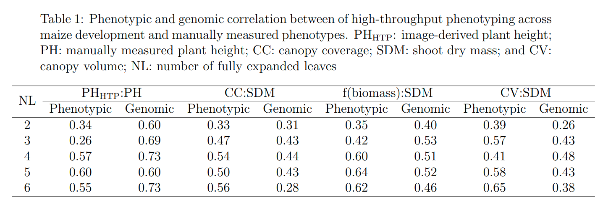
```

---
class: animate__animated, animate__fadeIn
```{r, echo=FALSE, out.width="100%", fig.align="center"}
knitr::include_graphics("figs/CS.png")
```
---
class: animate__animated, animate__fadeIn
# Classification of Inoculation with Plant Growth-Promoting Bacteria
```{r, echo=FALSE, out.width="50%",fig.cap="", fig.align="center"}
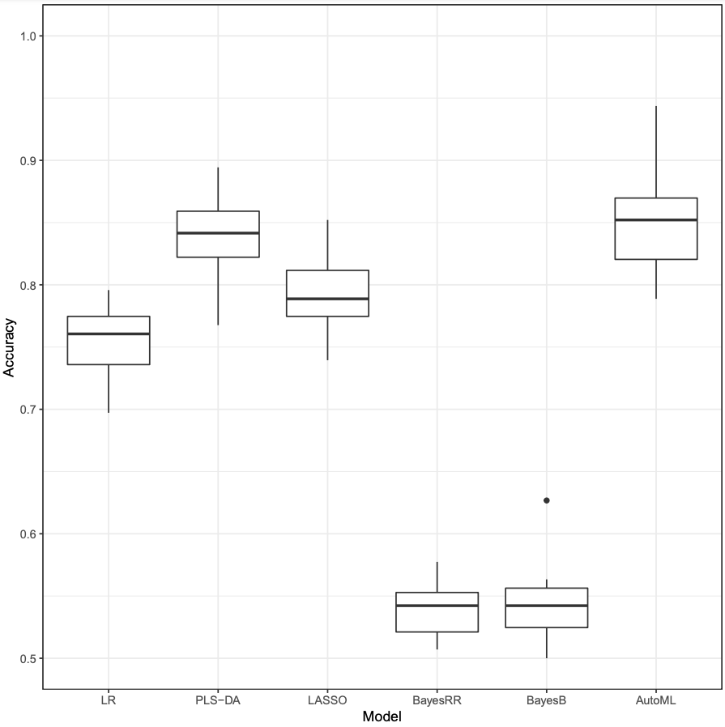
```
<p style="font-family: times, serif; font-size:11pt; font-style:italic">
Figure. Classification accuracy of inoculation status (B+ and B−) using 150 hyperspectral bands.
</p>

---
class: animate__animated, animate__fadeIn
# Genomic, Phenomic, and Multi-omics Prediction

```{r, echo=FALSE, out.width="80%",fig.cap="", fig.align="center"}
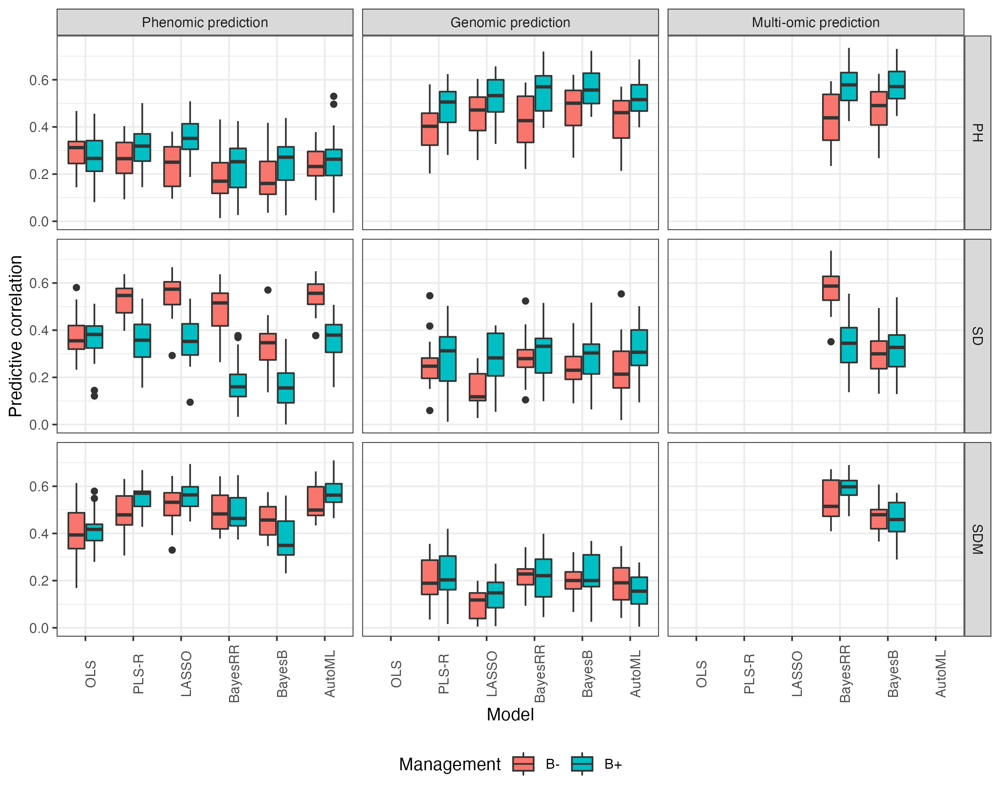
```
<p style="font-family: times, serif; font-size:11pt; font-style:italic">
Figure. Predictive ability of plant height (PH), stem diameter (SD), and shoot dry mass (SDM) using phenomic, genomic, and multi-omics prediction models under each management condition (B+ and B−).
</p>

---
class: animate__animated, animate__fadeIn
```{r, echo=FALSE, out.width="100%", fig.align="center"}
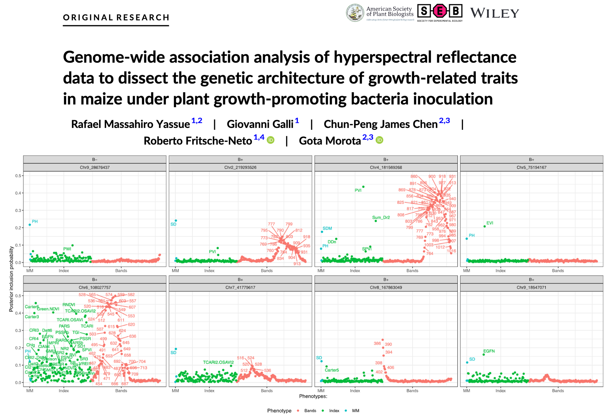
```
---
class: animate__animated, animate__fadeIn
# Phenome-wide association studies (PheWAS)
```{r, echo=FALSE, out.width="100%",fig.cap="", fig.align="center"}
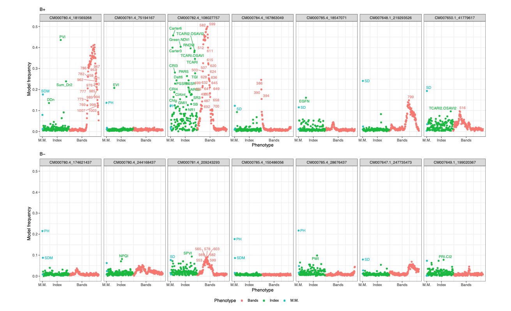
```
<p style="font-family: times, serif; font-size:11pt; font-style:italic">
Figure. PheWAS for the 10 most frequent SNPs in models for plant height (PH), stem diameter (SD), and shoot dry mass (SDM) under B+ management.
</p>
---
class: animate__animated, animate__fadeIn
# Multi-phenotype GWAS
```{r, echo=FALSE, out.width="70%",fig.cap="", fig.align="center"}
knitr::include_graphics("figs/2.gif")
```
<p style="font-family: times, serif; font-size:11pt; font-style:italic">
Figure. Multi-phenotype GWAS for the 281 hyperspectral phenotypes under B+ management.
</p>

---
class: animate__animated, animate__fadeIn
# Thermal Camera in Disease Identification
```{r, echo=FALSE, out.width="100%",fig.cap="", fig.align="center"}
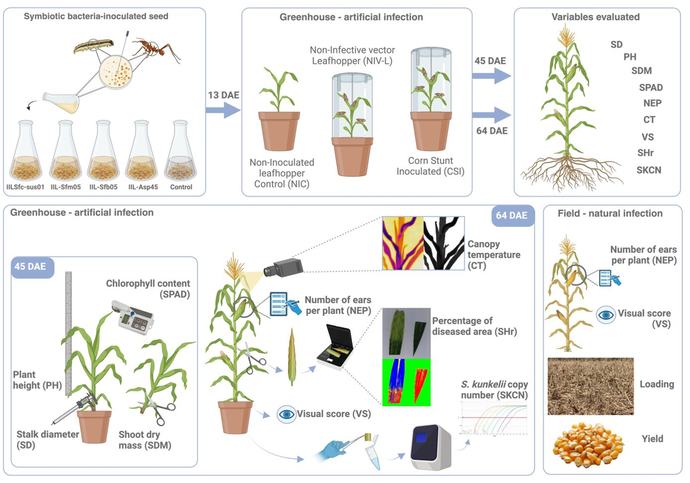
```

---
class: animate__animated, animate__fadeIn
# Thermal Camera in Disease Identification
```{r, echo=FALSE, out.width="120%",fig.cap="", fig.align="center"}
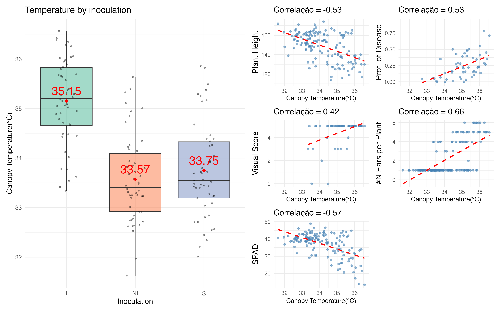
```


---
class: animate__animated, animate__fadeIn, inverse, center, middle

# Applications, Factors Influencing Accuracy, and Limitations of the Methodology

---

class: animate__animated, animate__fadeIn
# Phenomics vs Genomics

<div style="transform: scale(0.75); transform-origin: top center;">

<table style="width:100%; border-collapse: collapse;">
  <thead>
    <tr>
      <th style="border: 1px solid #ddd; padding: 6px; text-align: left;">Aspect</th>
      <th style="border: 1px solid #ddd; padding: 6px; text-align: left;">Genomic Selection (GS)</th>
      <th style="border: 1px solid #ddd; padding: 6px; text-align: left;">Phenomics / HTP</th>
    </tr>
  </thead>
  <tbody>
    <tr>
      <td style="border: 1px solid #ddd; padding: 6px;">Prediction basis</td>
      <td style="border: 1px solid #ddd; padding: 6px;">Molecular markers (SNPs)</td>
      <td style="border: 1px solid #ddd; padding: 6px;">High-resolution phenotypic traits</td>
    </tr>
    <tr>
      <td style="border: 1px solid #ddd; padding: 6px;">Estimated effects</td>
      <td style="border: 1px solid #ddd; padding: 6px;">Genetic, mainly additive</td>
      <td style="border: 1px solid #ddd; padding: 6px;">Phenotypic variance; may include environmental effects and possible overestimation of accuracy in CV and validation</td>
    </tr>
    <tr>
      <td style="border: 1px solid #ddd; padding: 6px;">When applied</td>
      <td style="border: 1px solid #ddd; padding: 6px;">Can be done <b>before field evaluation</b></td>
      <td style="border: 1px solid #ddd; padding: 6px;">Requires growing plants</td>
    </tr>
    <tr>
      <td style="border: 1px solid #ddd; padding: 6px;">Accuracy</td>
      <td style="border: 1px solid #ddd; padding: 6px;">Depends on training population, years, panel size</td>
      <td style="border: 1px solid #ddd; padding: 6px;">High for <b>physiological and structural traits</b></td>
    </tr>
    <tr>
      <td style="border: 1px solid #ddd; padding: 6px;">Cost per individual</td>
      <td style="border: 1px solid #ddd; padding: 6px;"><b>Medium</b>: Laboratory + reagents</td>
      <td style="border: 1px solid #ddd; padding: 6px;">High initial cost, <b>drops with scale</b>, no reagent cost</td>
    </tr>
    <tr>
      <td style="border: 1px solid #ddd; padding: 6px;">Cycle speed</td>
      <td style="border: 1px solid #ddd; padding: 6px;"><b>Very fast</b>, enables early selection</td>
      <td style="border: 1px solid #ddd; padding: 6px;"><b>Fast</b>, but depends on phenological stage</td>
    </tr>
    <tr>
      <td style="border: 1px solid #ddd; padding: 6px;">Traits</td>
      <td style="border: 1px solid #ddd; padding: 6px;">Prediction only for known traits</td>
      <td style="border: 1px solid #ddd; padding: 6px;">Inference of new physiological and structural traits</td>
    </tr>
    <tr>
      <td style="border: 1px solid #ddd; padding: 6px;">Ideal integration</td>
      <td colspan="2" style="border: 1px solid #ddd; padding: 6px;">
        <b>GS + Phenomics → Multi-omics Integration:</b> Increases accuracy, robustness, and genetic gain.
      </td>
    </tr>
  </tbody>
</table>

</div>


---
class: animate__animated, animate__fadeIn

# Generation of Orthomosaics Using Limited-Resolution Images

```{r, echo=FALSE, out.width="100%", fig.align="center"}
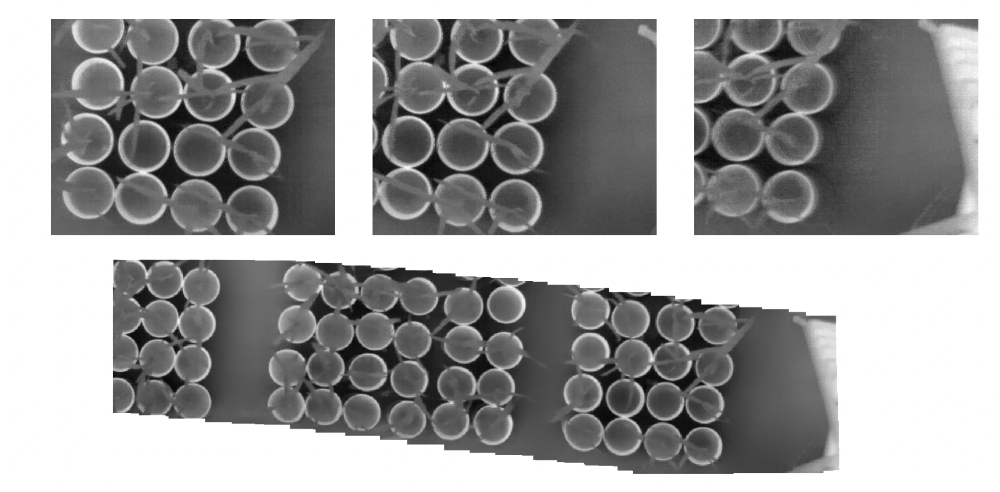
```
<p style="font-family: times, serif; font-size:11pt; font-style:italic">
Figure. Several attempts at orthomosaic assembly and image stitching using thermal images.
</p>
---
class: animate__animated, animate__fadeIn

# HTP challenges
```{r, echo=FALSE, out.width="100%", fig.align="center"}
knitr::include_graphics("figs/problem/1.png")
```
<p style="font-family: times, serif; font-size:11pt; font-style:italic">
Figure. Representation of different shapefiles.
</p>

---
class: animate__animated, animate__fadeIn

# Generation of Shapefiles and Plot Delimitation
```{r, echo=FALSE, out.width="199%", fig.align="center"}
knitr::include_graphics("figs/problem/2.png")
```
<p style="font-family: times, serif; font-size:11pt; font-style:italic">
Figure. Representation of different shapefiles.
</p>
---
class: animate__animated, animate__fadeIn

# Generation of Shapefiles and Plot Delimitation
```{r, echo=FALSE, out.width="100%", fig.align="center"}
knitr::include_graphics("figs/problem/3.png")
```
<p style="font-family: times, serif; font-size:11pt; font-style:italic">
Figure. Representation of different shapefiles.
</p>

---
class: animate__animated, animate__fadeIn

# Generation of Shapefiles and Plot Delimitation
```{r, echo=FALSE, out.width="100%", fig.align="center"}
knitr::include_graphics("figs/problem/4.png")
```
<p style="font-family: times, serif; font-size:11pt; font-style:italic">
Figure. Representation of different shapefiles.
</p>

---
class: animate__animated, animate__fadeIn

# Generation of Shapefiles and Plot Delimitation
```{r, echo=FALSE, out.width="100%", fig.align="center"}
knitr::include_graphics("figs/problem/4.png")
```
<p style="font-family: times, serif; font-size:11pt; font-style:italic">
Figure. Representation of different shapefiles.
</p>

---
class: animate__animated, animate__fadeIn

# Factors Impacting the Accuracy of High-Throughput Phenotyping

<div style="transform: scale(0.75); transform-origin: top center;">

| **Factor**                  | **Description**                                                                 |
| :-------------------------- | :------------------------------------------------------------------------------ |
| **Sensor Quality**          | Higher-resolution sensors capture more detailed data                            |
| **Environmental Conditions**| Climate, lighting, and temperature variations affect accuracy                    |
| **Phenotypic Diversity**    | Greater genetic variability in plants can generate more complex measurements     |
| **Data Processing**         | Quality of filtering, normalization, and data analysis algorithms                |
| **Calibration**             | Proper calibration of sensors ensures consistency and reduces errors             |
| **Sampling Density**        | More frequent sampling improves temporal resolution                              |
| **Data Fusion**             | Combining multiple sensor types increases accuracy in trait detection            |
| **Platform Stability**      | Fixed platforms produce more consistent and reliable data                        |
| **User Expertise**          | Knowledge of operation and interpretation influences reliability                 |


---
class: animate__animated, animate__fadeIn

# Current Challenges

<div style="transform: scale(0.70); transform-origin: top left; overflow: auto;width: 150%; height: 100%">

| **Challenge Type**       | **Technical Challenges**                                        | **Biological Challenges**                                 |
| :----------------------- | :-------------------------------------------------------------- | :------------------------------------------------------- |
| **High Costs**           | Expensive equipment, especially advanced sensors                | Making sensors more accessible for broad use             |
| **Data Storage**         | Large data volumes require robust storage and processing        | Turning data into useful information for plant breeding  |
| **Calibration**          | Difficulties calibrating sensors due to environmental variables | Standardizing biological traits across different species |
| **Accuracy**             | Variation in sensor performance under different environments    | Biological variability between species may affect data consistency |
| **Data Integration**     | Difficulty integrating data from multiple sensor types           | Combining phenotypic and genetic data for better predictions |
| **Real-Time Analysis**   | Need to process large data volumes in real time                  | Complexity of analyzing dynamic biological processes in real time |
| **Platform Limitations** | Constraints in mobility and accessibility of platforms           | Adapting phenotyping methods to different crops and growth stages |
| **Scalability**          | Difficulty scaling HTP to large areas or multiple species        | Ensuring biological relevance at scale and across ecosystems |
| **Breeding Integration** | Defining breeding strategies when correlation with target trait is moderate |                                                          |
---
class: animate__animated, animate__fadeIn

# Phenomics Data Flow

```{r, echo=FALSE, out.width="100%", fig.align="center"}
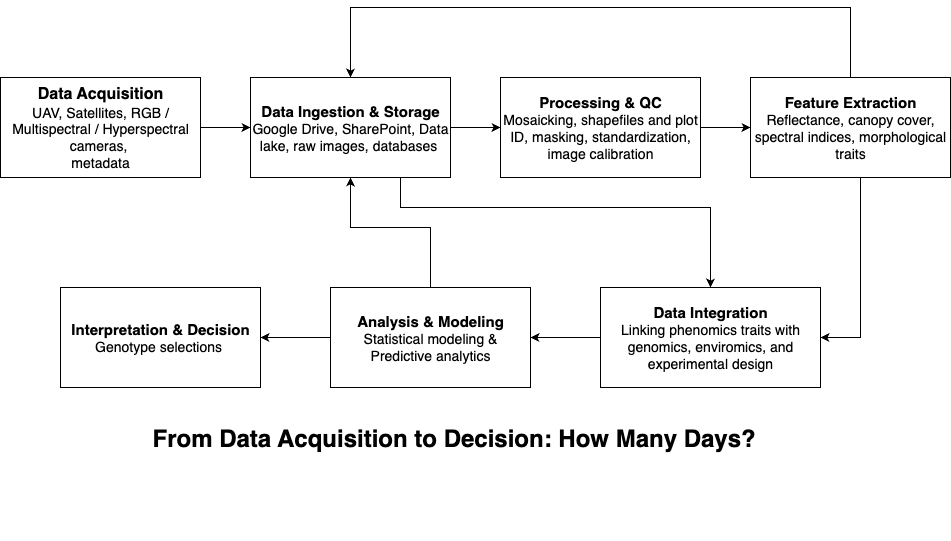
```


---
class: animate__animated, animate__fadeIn

# In essence

- Phenomics increases genetic gain by improving accuracy and reducing costs  

- Affordable technologies allow large-scale use, even with limited budgets  

- Integration with genomics is the future: more robustness, more efficiency  

- Breeding strategies to maximize the accuracy of phenomics models  

- Multi-omics → the key to next-generation breeding

---
class: animate__animated, animate__fadeIn, middle

# Acknowledgments 

```{r, echo=FALSE, out.width="100%", fig.cap="", fig.align="center"}
knitr::include_graphics("figs/plot.jpg")
```

---

class: animate__animated, animate__fadeIn

<br /> <br /> <br /> <br /> <br /> <br />
#.center[Muito obrigado! ]

.right[[rafael.yassue@gmail.com](mailto:rafael.yassue@gmail.com?subject=%20Presentation)]
.right[https://rafaelyassue.github.io/cv-online/]
```{r, echo=FALSE, out.width="50%",fig.cap="", fig.align="right"}
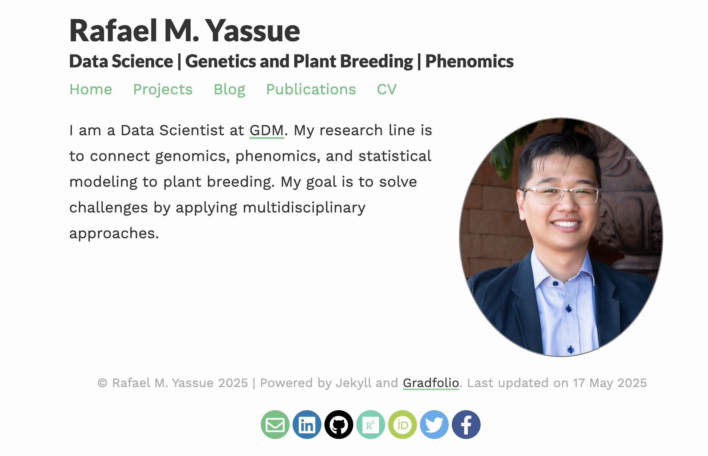
```

